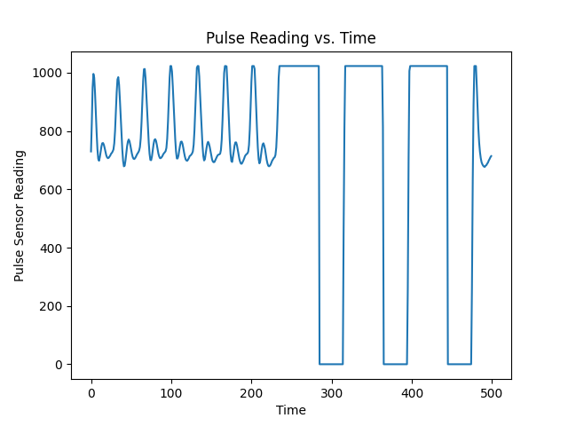
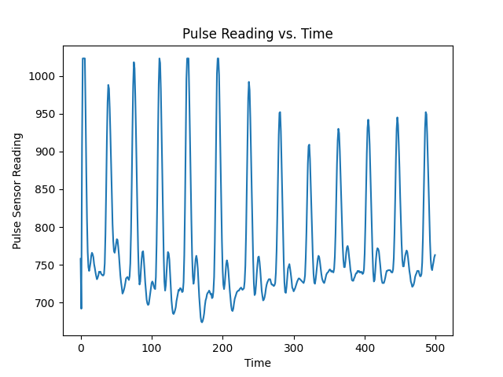
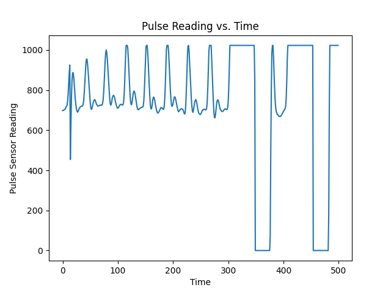
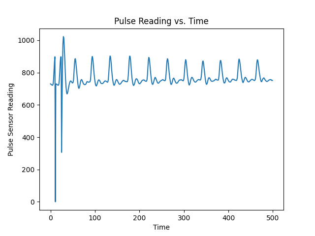

# DeepTricorder

## Requirements
 - Windows 10: This project developed on a Windows 10 computer, so these instructions will work in that setting. Anything else will most likely require some modifications. 
 - Tensorflow 2.0+: `conda create -n tf-gpu tensorflow-gpu cudatoolkit=10.1` will care of both CUDA and TF environments. 
 - Some Python stuff: `pip install opencv-python scipy numpy matplotlib`

## Get Started
To simply try out the app: 
1. Set your Android phone to developer mode, with ADB debugging enbabled. 
2. Plug your phone into your computer. Ensure that it shows up if you run `adb devices`. 
3. Go into the personalization_module folder and double-click on `revert.bat.` This will install the original, existing APK.

Alternatively, feel free to open it up in Android Studio and freshly build & install it from there. 

## Personalization Instructions
A large feature of this project enables developer-oriented users to personalize the app for themselves. This requires obtaining a [pulse sensor](https://pulsesensor.com/). You may also use any pulse sensor which connects to a COM port and communicates raw values via USB Serial at a baud rate of 9600. If using the aforementioned pulse sensor, follow the steps on the website to get a clean signal. 

1. Check that your webcam is working and that your face and shoulders are centered. 

2. Collect the port number the sensor is plugged into, and ensure that the pulse sensor is reading a clean signal. This is most easily done using the live serial plotter from the Arduino IDE, but if you don't want to do that, you may double-click on the `test_sensor.bat` file and enter the port number, which will collect, plot, and save around 5 seconds of data into `pulse_test.png`. You want to make sure the values are around 700, and don't depict what happens below by shifting between 0 and 1024. The latter occurs when the sensor isn't fully covered with the right amount of pressure.

Bad Signals           |  Good Signals
:-------------------------:|:-------------------------:
  |  
  |  

3. Plug in your Android phone. Ensure that it is in developer mode, has ADB debugging enabled, and shows up if you run `adb devices`.

4. Double-click on the `personalize.bat` file. Enter in the port number. This will open a live preview of the webcam data while printing out the sensor values. Press the 'Q' key to exit once you feel you've recorded enough data (30 seconds is what we've been doing). Then, the script will take care of the rest!

5. This is still in the prototype phase. If you run into errors, re-run the script a few times, and we'll do our best to make this more robust. 
